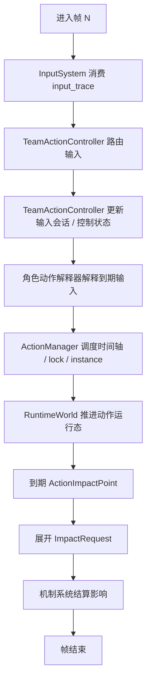

# 动作系统设计草案

> 状态：草案。
> 本文档记录动作输入、队伍切换、角色动作解释与通用动作调度之间的阶段性设计。尚未确认的游戏机制、帧数和取消规则统一列入“待讨论事项”，不要视为最终数值契约。

最后更新：2026-07-08

## 1. 设计目标

动作系统用于把玩家输入解释为可审计、可推进、可结算的仿真动作。

当前阶段优先解决以下问题：

- 输入轨迹只记录按键事实，不直接等同于具体动作。
- 玩家在战斗中控制的是队伍，而不是单个永久固定的角色。
- 当前场上角色决定同一个按键在当前上下文中的动作含义。
- 队伍级控制层负责输入会话归属、输入路由和切人对输入会话的影响。
- `ActionManager` 保持通用调度职责，不实现具体角色、武器或圣遗物机制。
- 角色动作解释由 `content/` 通过 handler 或解释器提供，并在组装阶段注入。

本文不定义具体角色技能帧数、倍率、命中段、取消窗口或长按阈值来源。这些内容需要可信资料、旧项目参考或 golden case 支撑后再进入实现。

## 2. 核心理解

原神的动作控制不是“一个玩家对象永久绑定一个角色动作表”，而是队伍级控制。

推荐理解：

```text
玩家输入
-> TeamActionController 队伍控制上下文
-> 当前 active_slot 对应的角色动作解释器
-> ActionManager 通用动作调度器
-> SpaceRuntime 空间运行态入口
-> 动作实例 / 影响点 / 后续机制系统
```

同一个按键只表示控制意图。例如 `keyboard.e` 表示玩家操作了战技按钮，不表示某个具体角色的具体战技已经发生。

某一帧输入的实际含义取决于：

- 当前场上槽位。
- 当前场上角色。
- 当前动作状态。
- 当前输入会话。
- 是否处于 busy、切人后摇、可取消窗口或特殊控制状态。
- 角色动作解释器给出的解释结果。

因此动作系统需要把“按键事实”“输入会话”“动作解释结果”和“动作实例调度”拆开建模。

推荐核心分层：

```text
InputSystem
-> TeamActionController
-> CharacterActionInterpreter
-> ActionManager
-> SpaceRuntime
```

其中 `TeamActionController` 体现队伍级输入事实和输入会话，`CharacterActionInterpreter` 体现角色级动作语义，`ActionManager` 只处理已经解释完成的通用动作调度请求，`SpaceRuntime` 持有空间相关运行态并按空间实体把动作实例交给对应消费器。

## 3. 术语

### 3.1 按键事实

按键事实来自 `input_trace`，只描述某帧发生了什么输入：

```text
frame=N
key=keyboard.e
phase=press | release
```

按键事实由 `InputSystem` 校验与分发，不直接创建具体动作。

### 3.2 控制意图

控制意图是按键在默认控制布局中的抽象含义：

```text
keyboard.e      -> 战技按钮
keyboard.q      -> 爆发按钮
mouse.left      -> 攻击按钮
mouse.right     -> 冲刺按钮
keyboard.space  -> 跳跃按钮
keyboard.1~4    -> 切换到对应队伍槽位
```

控制意图仍不是最终动作。最终动作需要当前角色动作解释器判定。

### 3.3 输入会话

输入会话表示一个动作按钮从 `press` 到 `release` 的生命周期。

输入会话由 `TeamActionController` 创建和维护。它属于队伍级输入路由状态，不属于 `ActionManager` 的通用动作调度状态。

建议第一版通用结构包含：

```text
InputActionSession
├── session_id
├── key
├── owner_slot_at_press
├── press_frame
├── release_frame?
├── held_frames?
├── state
└── interpretation?
```

输入会话用于支持点按、长按、按住进入特殊状态、松开发射、输入取消和审计。

建议第一版会话状态包含：

```text
pending       -> 已 press，尚未解释出最终动作
deferred      -> 已被解释器要求等待后续帧或 release
interpreted   -> 已得到解释结果
scheduled     -> 已提交通用动作时间轴
canceled      -> 已被切人或其他规则取消
released      -> 已正常 release
ignored       -> release 没有对应有效会话或不应补触发
```

### 3.4 角色动作解释器

角色动作解释器属于 `content/`，负责把输入会话解释为角色动作意图。

动作解释器只由角色内容贡献。武器和圣遗物不提供动作解释器，也不能通过修饰器、触发器或影响工厂改变动作解释结果或动作时间轴。

它可以根据角色、天赋、命座、当前动作状态和输入持续时间，返回通用解释结果。例如：

```text
defer                  -> 继续等待 release 或判断窗口
defer_until            -> 等到指定帧重新解释
reject                 -> 当前状态不接受该输入
schedule_timeline      -> 生成通用动作时间轴
enter_control_state    -> 进入按住、蓄力、瞄准或特殊姿态等状态
cancel_session         -> 取消输入会话
```

解释器不直接推进模拟器帧循环，也不直接写结果库。

### 3.5 动作控制状态

动作控制状态表示输入解释阶段的临时控制上下文，由 `TeamActionController` 持有和推进。

它不是 `ActionInstance`，也不直接代表已经调度的动作时间轴。它用于描述“某个输入会话已经进入一种特殊控制状态，后续输入或帧推进需要按该状态重新解释”。

建议后续模型包含：

```text
ActionControlState
├── state_id
├── owner_slot
├── kind
├── source_session_id
├── enter_frame
├── deadline_frame?
├── next_tick_frame?
├── tick_policy?
├── release_policy?
├── allowed_inputs
├── cancel_policy
└── data
```

`kind` 第一版建议保持克制：

```text
holding      -> 按住状态，覆盖长按、蓄力和按住期间周期 tick
aiming       -> 瞄准状态
stance       -> 特殊姿态，后续输入含义被改写
modal        -> 更强的模式状态，可能捕获一组输入
```

不单独引入 `channeling`。按住期间每隔若干帧可能生成影响点或动作 tick 的行为，归入 `holding`。

`holding` 可以只触发以下行为中的一部分，也可以同时触发：

```text
hold_tick      -> 按住期间按规则周期性生成动作 tick 或影响点
release_action -> release 时根据 held_frames 生成一个动作时间轴
```

例如：

```text
frame=100: keyboard.e press
-> 创建 InputActionSession
-> 解释器返回 enter_control_state(kind=holding, next_tick_frame=120)

frame=120: holding tick 到期
-> TeamActionController 询问解释器
-> 解释器可返回一个 tick ActionTimelineSpec
-> ActionManager 调度该 tick

frame=150: keyboard.e release
-> TeamActionController 询问解释器
-> 解释器可返回 release ActionTimelineSpec，或只结束 holding
```

已确认方向：

- 长按、蓄力、瞄准、特殊姿态等输入解释状态抽象为 `ActionControlState`。
- `ActionControlState` 由 `TeamActionController` 持有和推进，不归 `ActionManager` 所有。
- `holding` 覆盖长按、蓄力和按住期间周期 tick，不再单独建 `channeling`。
- `holding` 可以只在按住期间生成 tick，也可以只在 release 时生成动作，也可以两者都生成。
- 任何 tick、release 动作或实际影响仍应由角色解释器生成 `ActionTimelineSpec`，再交给 `ActionManager` 调度。
- `ActionControlState` 不直接结算伤害、治疗、附着或 Buff。

### 3.6 通用动作时间轴

通用动作时间轴是角色解释器返回给 `ActionManager` 的调度规格。

建议后续模型包含：

```text
ActionTimelineSpec
├── action_key
├── source_key
├── actor_entity_id?
├── owner_slot
├── start_frame
├── duration_frames
├── params
├── lock_windows
├── cancel_windows
├── impact_frame_offsets
├── impact_points
└── metadata
```

`ActionManager` 可以根据该规格创建 `ActionInstance`、`ActionLock` 和 `ActionImpactPoint`，但不理解其中的具体角色机制含义。第一版中，未声明 `impact_frame_offsets` 的影响点使用动作开始帧；角色内容可以按 `impact_key` 声明相对动作开始帧的偏移，也可以在无可信命中帧时显式关闭默认影响点。

### 3.7 可取消窗口

可取消窗口属于通用动作时间轴字段，用于描述当前动作在某些帧允许被特定类型输入打断、截断或接续。

建议后续模型包含：

```text
CancelWindow
├── start_frame_offset
├── end_frame_offset
├── interrupt_kinds
├── policy
└── tags
```

窗口使用相对动作开始帧的 offset 表达。例如动作从第 100 帧开始，`start_frame_offset=18`、`end_frame_offset=40` 表示绝对帧范围为 118 到 140。

`interrupt_kinds` 可逐步扩展为：

```text
switch
dash
jump
normal_attack
skill
burst
movement
any
```

`policy` 可逐步扩展为：

```text
cancel_current      -> 取消当前动作，立即调度新动作
truncate_current    -> 当前动作提前结束，但保留已经发生的影响点
queue_next          -> 当前动作结束后接续新动作
ignore_current_lock -> 不取消当前动作，但允许新动作并行或特殊处理
```

已确认方向：

- 可取消窗口属于 `ActionTimelineSpec` 的通用时间轴字段。
- 可取消窗口以动作开始帧的相对 offset 表达。
- 具体角色动作解释器负责在时间轴规格中声明取消窗口。
- `ActionManager` 根据当前帧和 `interrupt_kind` 查询是否允许取消、截断或接续。
- `TeamActionController` 只发起对应类型的中断请求，不自行解释取消窗口。

### 3.8 动作影响请求

动作影响请求是动作系统与后续机制系统之间的接口。

`ActionImpactPoint` 只表示“某个动作在某一帧产生了一个或多个待结算影响”，不表示最终已经造成伤害、治疗、元素附着或 Buff。

建议后续模型包含：

```text
ImpactRequest
├── request_id
├── kind
├── owner_slot
├── action_key
├── impact_key
├── source_impact_point_id
├── target_refs
├── scaling_ref?
├── element?
├── tags
└── params
```

`kind` 可以逐步扩展为：

```text
damage
heal
apply_aura
apply_status
create_entity
energy
movement
```

这些请求仍然不是最终结果。最终结果由伤害、治疗、元素附着、反应、Buff/Status 等机制系统结算。

## 4. 职责边界

### 4.1 InputSystem

`InputSystem` 负责：

- 校验输入轨迹结构。
- 维护按键 press/release 生命周期。
- 计算 `held_frames`。
- 按帧、按配置顺序分发输入事实。
- 发布输入事实相关事件。

`InputSystem` 不负责：

- 判断技能点按或长按。
- 判断角色是否能动作。
- 创建 `ActionInstance`。
- 修改队伍或角色战斗状态。

### 4.2 TeamRuntimeState

`TeamRuntimeState` 负责：

- 持有队伍槽位与角色运行态。
- 维护当前 `active_slot`。
- 通过受控接口处理切人请求。

`TeamRuntimeState` 不负责：

- 解释战技、爆发、攻击、跳跃或冲刺按钮。
- 创建动作时间轴。
- 处理伤害、反应或效果。

### 4.3 TeamActionController

`TeamActionController` 是队伍级输入路由器。

它负责：

- 接收 `InputSystem` 分发的按键事实。
- 读取当前 `active_slot` 并决定新的动作按钮输入归属。
- 创建、维护和结束 `InputActionSession`。
- 记录 `owner_slot_at_press`，保证 release 回到原输入会话。
- 持有并推进 `ActionControlState`。
- 将切人输入翻译为 `team.switch` 通用动作时间轴。
- 提供受控接口供切人消费器取消已切出槽位的待定输入会话。
- 找到 owner slot 对应的角色动作解释器。
- 将输入会话交给角色动作解释器解释。
- 把解释器生成的通用动作时间轴提交给 `ActionManager` 调度。

它不负责：

- 计算具体技能倍率、伤害、治疗或反应。
- 自己创建 `ActionInstance`、`ActionLock` 或 `ActionImpactPoint`。
- 绕过角色动作解释器硬编码具体角色动作。
- 持有或修改 `TeamRuntimeState`。
- 直接调用 `TeamRuntimeState.switch_to(...)` 或同步 `Space`。
- 直接访问 SQLite、UI、资产仓库或结果库。

### 4.4 ActionManager

`ActionManager` 是通用动作调度器和动作运行态拥有者。

它负责：

- 接收已经解释完成的通用动作调度请求。
- 管理 busy lock、动作实例和动作生命周期。
- 根据通用时间轴规格创建 `ActionInstance`。
- 记录动作请求、接受、拒绝、取消、调度结果和通用消费结果。
- 在帧推进时触发到期的通用影响点。
- 将到期 `ActionImpactPoint` 交给 `ImpactDispatcher` 展开为机制请求。
- 对外暴露是否空闲，保证模拟器不会在动作未结束时提前停止。

它不负责：

- 写死具体角色技能逻辑。
- 判断某个角色的 `keyboard.e` 是点按、长按还是特殊状态。
- 持有原始输入会话或解释 press/release 生命周期。
- 持有或推进 `ActionControlState`。
- 判断 `TeamRuntimeState` 中目标槽位是否合法。
- 直接修改队伍、目标或空间实体运行态。
- 直接结算 `ImpactRequest`。
- 计算技能倍率、伤害、治疗、元素反应或 Buff。
- 访问 SQLite、UI、资产仓库或结果库。

### 4.5 content 角色动作解释器

`content/` 中的角色动作解释器负责：

- 解释当前角色对同一按键的具体响应。
- 决定输入会话是否继续等待、被拒绝、进入特殊状态或生成动作时间轴。
- 根据角色数据、handler 参数和运行态生成通用 `ActionTimelineSpec`。

它不负责：

- 推进全局帧循环。
- 直接保存结果。
- 直接访问 SQLite。
- 绕过 `ActionManager` 修改通用动作调度状态。

### 4.6 机制系统

机制系统负责把 `ImpactRequest` 结算为真实运行态变化和事件。

它负责：

- 根据伤害请求计算最终伤害并修改目标状态。
- 根据治疗请求计算最终治疗并修改角色状态。
- 根据附着请求处理元素附着、反应和 ICD。
- 根据 Buff 请求创建、刷新或移除效果状态。
- 发布可审计的结算事件。

它不负责：

- 解释原始按键输入。
- 维护输入会话。
- 判断角色动作点按、长按或切人逻辑。
- 管理动作 busy lock 或动作实例生命周期。

### 4.7 SpaceRuntime

`SpaceRuntime` 是空间运行态入口，不属于原神机制系统。它直接持有 `Space`、`TargetRuntimeCollection`、`CreatedObjectRuntime` 和 `player:active` 对应的队伍运行态引用；动作消费只是它的一项能力。

它负责：

- 持有空间实体容器 `Space`。
- 持有并提供目标运行态集合 `TargetRuntimeCollection`。
- 持有内容创建空间实体运行态 `CreatedObjectRuntime`。
- 同步内容创建对象的 `SpatialEntity` 到 `Space`。
- 提供空间查询和候选目标解析入口。
- 按 `(actor_entity_id, action_key)` 注册动作消费器。
- 消费已到开始帧且尚未消费的 `ActionInstance`。
- 把实例交给对应空间实体绑定的运行态消费器。
- 将消费结果写回 `ActionManager` 的通用消费记录。

它不负责：

- 解释原始输入。
- 调度 busy lock。
- 计算伤害、治疗、反应或 Buff。
- 定义具体角色、武器或圣遗物机制。

## 5. `keyboard.e press` 的判断窗口

`keyboard.e press` 不应立即创建 `ActionInstance`。

建议第一版行为：

```text
keyboard.e press at frame=N
-> TeamActionController 创建 InputActionSession
-> 记录 owner_slot_at_press = 当前 active_slot
-> 记录 press_frame = N
-> 进入 pending 状态
-> 不创建 ActionInstance
-> 不创建默认 ActionImpactPoint
```

随后由两个触发点驱动解释：

```text
到达判断窗口且按键仍按住
-> TeamActionController 询问 owner_slot 对应角色解释器是否进入长按、蓄力、瞄准或持续状态

keyboard.e release
-> TeamActionController 根据 session 的 owner_slot_at_press 和 held_frames 询问角色解释器
-> 解释器返回 reject / schedule_timeline / cancel_session 等通用结果
-> 如返回 schedule_timeline，再提交给 ActionManager 调度
```

判断窗口的具体帧数不在本文确定。它可能来自角色动作数据、通用默认值或后续手工整理的内容配置。

已确认方向：

- 判断窗口不是 `ActionManager` 的全局常量。
- 判断窗口由角色动作解释器在解释 `press` 时返回，例如 `defer_until(frame)`。
- `TeamActionController` 只负责保存会话、记录下一次需要重新解释的帧，并在对应帧再次询问角色动作解释器。
- 没有具体角色实现时，测试解释器可以使用显式默认窗口；该默认值只服务测试，不代表真实角色机制。
- 真实角色的判断窗口需要来自角色动作数据、可信资料、旧项目参考或 golden case，不由 `core` 凭空写死。

## 6. 输入会话归属

输入会话应记录 `owner_slot_at_press`，不能只在 `release` 时读取当前 `active_slot`。

例如：

```text
frame=100: keyboard.e press, active_slot=1
frame=110: keyboard.2 press, active_slot 切到 2
frame=130: keyboard.e release, active_slot=2
```

此时 `keyboard.e release` 默认仍对应 frame 100 开启的输入会话。系统必须明确处理该会话，而不是把 release 临时解释成 slot 2 的战技释放。

中途切人时，已有输入会话可能有多种处理策略：

- 切人成功时取消原角色输入会话。
- 切人请求因当前会话或动作状态被拒绝。
- 原角色会话保留到 release 并被解释为无效或取消。
- 特定机制允许跨角色保留输入状态。

第一版建议采用保守策略：输入会话归属 press 时的槽位；切人如何影响已有会话暂列待讨论，不在通用层写死复杂角色规则。

已确认方向：

- 第一版中，切人成功会取消切出角色仍处于 `pending` 或 `deferred` 状态的动作输入会话。
- 被取消的输入会话进入 `canceled` 状态，并记录取消原因。
- 被取消会话不会在后续 `release` 时补触发动作。
- 后续 `release` 仍由 `InputSystem` 消费，用于关闭物理按键状态；`TeamActionController` 可记录为 `ignored` 或无有效会话 release。
- 特殊跨角色保留输入状态不作为通用规则，未来只为明确机制单独扩展。

## 7. 切人与动作解释器切换

切人是队伍级控制动作，会改变后续输入使用的角色动作解释器。

建议流程：

```text
keyboard.2 press
-> TeamActionController 接收切人输入
-> TeamActionController 提交 team.switch 动作时间轴
-> ActionManager 根据 busy lock 判断是否接受该动作实例
-> SpaceRuntime 将 player:active / team.switch 分发给切人消费器
-> 切人消费器请求 TeamRuntimeState 切到 slot 2
-> 成功后同步 Space 中 player:active.active_slot
-> 成功后取消切出槽位的待定输入会话
-> 后续新的动作按钮 press 使用 slot 2 的角色动作解释器
```

切人本身是否受当前动作 busy、取消窗口或输入会话影响，需要独立规则。通用设计上应支持：

- busy 期间拒绝切人。
- 可取消窗口内允许切人。
- 切人触发当前动作取消。
- 特定状态禁止切人。

这些规则不应由 `TeamRuntimeState` 独自决定，也不应硬编码为所有角色通用。

已确认方向：

- 切人默认检查当前动作 busy lock。
- 当前帧存在 busy lock 时，切人默认被拒绝。
- 如果当前动作时间轴在该帧声明允许 `switch` 类型取消，切人可以被接受。
- `ActionManager` 提供当前动作是否允许 `switch` cancel 的查询，并负责动作取消或截断。
- `TeamActionController` 负责接收切人输入，并把它翻译为 `team.switch` 动作时间轴。
- `SpaceRuntime` 负责消费被接受的 `team.switch` 动作实例，并通过切人消费器请求 `TeamRuntimeState.switch_to(...)`。
- `TeamRuntimeState` 只维护槽位合法性和 `active_slot`，不判断 busy、后摇或取消窗口。

## 8. 推荐帧内流程



说明：

- 第 N 帧输入在第 N 帧开始送达。
- `press` 可以只创建输入会话，不立即生成动作实例。
- 输入会话归属、切人输入路由和角色解释器选择发生在 `TeamActionController`。
- `release` 或判断窗口到期时，才可能产生动作解释结果。
- 动作实例与影响点进入后续机制系统前仍只是通用运行态，不等于最终伤害或反应。

## 9. 动作影响结算边界

动作造成的影响需要分为“动作时间轴影响点”和“机制结算结果”两层。

推荐链路：

```text
ActionTimelineSpec
-> ActionInstance
-> ActionImpactPoint
-> ImpactRequest
-> DamageSystem / HealSystem / AuraSystem / BuffSystem
-> 运行态变化与事件
```

### 9.1 ActionImpactPoint

`ActionImpactPoint` 属于动作时间轴。

它回答：

- 哪个动作在第几帧产生影响点。
- 影响点来自哪个角色或槽位。
- 影响点引用哪些候选目标。
- 影响点应该展开哪些影响请求。

影响点帧号由 `ActionTimelineSpec.start_frame + impact_frame_offsets[impact_key]` 得出；未声明偏移时使用 0。动作没有可确认影响点时不应把动作开始帧当作命中帧。

它不回答：

- 是否最终命中。
- 最终伤害是多少。
- 是否暴击。
- 是否触发反应。
- 是否修改生命值、能量、附着或 Buff 状态。

### 9.2 ImpactRequest

`ImpactRequest` 是机制结算请求。

它回答：

- 这次请求的类型是伤害、治疗、附着、施加状态还是其他影响。
- 请求使用哪个 `impact_key` 或 `scaling_ref`。
- 请求来自哪个动作和角色。
- 请求的候选目标或目标引用是什么。
- 请求携带哪些标签、元素、参数或结算提示。

它仍然不是最终结果。比如伤害请求只是“准备造成一次某类型伤害”，最终伤害值需要由伤害系统读取属性、倍率、增伤、抗性、暴击、反应等上下文后计算。

### 9.3 机制系统

机制系统负责把请求落成结果。

示例：

```text
DamageSystem
-> 读取攻击方属性、技能倍率、目标抗性、增伤、暴击、反应
-> 生成伤害结果并修改目标状态

HealSystem
-> 读取治疗倍率、治疗加成、受治疗加成
-> 生成治疗结果并修改角色状态

AuraReactionSystem
-> 处理元素附着、反应、ICD
-> 生成附着和反应结果
```

这样的边界可以保证动作系统只描述“何时、由谁、以什么影响定义发起结算请求”，机制系统负责“这个影响最终造成了什么”。

### 9.4 空间实体创建

动作影响可以请求创建一个内容定义的空间实体。这里不再把“召唤物”作为 `core/` 的独立系统概念；如果游戏语义上称为召唤物、场地物或临时造物，只要它存在于战场空间中，就应作为带生命周期的空间实体处理。

无空间位置、不参与空间查询的持续逻辑不属于空间实体。后台协同攻击、周期 Buff、持续恢复、监听触发器等应归入机制、状态或 hook，而不是用“召唤物”承载。

推荐链路：

```text
ActionImpactPoint
-> ImpactRequest(kind=create_entity)
-> ImpactRuntime 通过 SpaceRuntime 转交 CreatedObjectRuntime
-> CreatedObjectRuntime 创建 CreatedObjectRuntimeState
-> SpaceRuntime 同步 SpatialEntity 到 Space
-> 后续机制、事件或实体行为按明确规则产生 ImpactRequest
-> 机制系统结算
```

概念规格：

```text
ImpactRequest(kind=create_entity)
├── params.object_key
├── owner_slot
├── action_key
└── params
    ├── duration_frames
    ├── position
    ├── facing?
    ├── behavior_key?
    ├── entity_id?
    ├── refresh_existing?
    ├── max_instances?
    ├── tags?
    └── object_params?
```

运行态：

```text
CreatedObjectRuntimeState
├── entity: SpatialEntity
├── object_key
├── behavior_key?
├── next_tick_frame?
├── tick_interval_frames?
└── params
```

已确认方向：

- `ActionManager` 不管理空间实体生命周期。
- `ActionImpactPoint` 可以通过 `ImpactRequest(kind=create_entity)` 请求创建内容定义的空间实体。
- 内容创建空间对象运行态与空间实体归 `core/space`，生命周期值对象复用 `core/entity_states/lifecycle.py`。
- `core/` 不保留独立 `SummonSystem`、`SummonSpec`、`SummonInstance` 或 `SummonFactory` 概念。
- 内容层可以提供空间实体创建行为，但不能把无空间持续机制伪装成空间实体。
- 空间实体后续造成的伤害、治疗、附着或 Buff/Status 仍走 `ImpactRequest -> 机制系统`。

### 9.5 术语边界

本文使用 `impact` 表示动作、空间实体行为或机制在某帧发起的“影响结算请求”，例如伤害、治疗、附着、创建空间实体或施加 Buff/Status。

`effect` 不再用于这条动作影响链路，避免和游戏语义中的 Buff、Status、Modifier 混淆。后续如果需要表达持续状态、增益、减益或条件修饰，应优先使用 `status`、`buff`、`modifier` 等更明确的术语。

## 10. 审计与结果记录

后续事件系统应能区分以下事实：

- 输入事实被消费。
- 输入会话开始。
- 输入会话进入判断窗口。
- 输入会话 release。
- 输入会话被取消或拒绝。
- 角色解释器给出解释结果。
- 动作时间轴被接受或拒绝。
- 动作实例开始、影响点到期、动作结束。
- 影响点展开了哪些 `ImpactRequest`。
- 是否创建、刷新或结束了内容创建空间实体。
- 空间实体行为或周期机制产生了哪些影响请求。
- 机制系统如何结算请求。
- 最终造成了哪些伤害、治疗、附着、反应、Buff 或状态变化。

这样可以在复盘中解释“玩家按了什么”和“动作系统最终接受了什么”之间的差异。

## 11. 迁移建议

建议按以下步骤演进：

1. 新增输入会话数据结构，只记录 press/release 生命周期，不改变现有最小闭环。
2. 新增 `TeamActionController`，让它负责创建和维护 pending 输入会话。
3. 将动作按钮 `press` 从“立即创建 `ActionInstance`”改为“由 `TeamActionController` 创建 pending 输入会话”。
4. 增加最小角色动作解释器协议，先提供通用测试解释器。
5. 让 `release` 或判断窗口通过解释器生成通用动作时间轴。
6. 让 `ActionManager` 只接收通用动作时间轴并负责调度。
7. 再扩展 `ActionInstance` 的时间轴、影响点和取消窗口。
8. 引入 `ImpactRequest`、`ImpactDispatcher` 和最小影响分发接口。
9. 最后接入具体角色 `content/` 实现与 golden case。

每一步都应补充最小单元测试，尤其覆盖：

- press 不立即生成动作实例。
- release 按 `owner_slot_at_press` 归属处理。
- busy 期间 press 被拒绝后 release 不补触发动作。
- 切人后新输入使用新的 active slot 解释器。
- 影响点只生成机制请求，不直接结算伤害或治疗。
- 未确认的切人会话策略保持显式测试或显式待讨论标记。

## 12. 已确认待落地事项

- 动作按钮判断窗口由角色动作解释器返回，不是 `ActionManager` 的全局常量。
- `TeamActionController` 负责按解释器返回的 `defer_until` 策略重新询问解释器。
- 切人默认受当前动作 busy lock 限制；只有当前动作时间轴声明本帧允许 `switch` cancel 时才可放行。
- `TeamRuntimeState` 不负责 busy 或取消窗口判断，只处理槽位合法性和 `active_slot` 变更。
- 第一版中，切人成功会取消切出角色仍处于 `pending` 或 `deferred` 状态的输入会话，后续 release 不补触发动作。
- 可取消窗口属于 `ActionTimelineSpec` 的通用字段，以动作开始帧的相对 offset 表达，由 `ActionManager` 按 `interrupt_kind` 查询。
- 长按、蓄力、瞄准、特殊姿态等输入解释状态抽象为 `ActionControlState`；其中 `holding` 覆盖长按、蓄力和按住期间周期 tick，不单独引入 `channeling`。
- 内容创建的场上对象是带生命周期的空间实体，对象运行态与空间实体归 `core/space`，生命周期值对象复用 `core/entity_states/lifecycle.py`。
- `core/` 不保留独立 `core/summons` 模块；无空间持续逻辑归机制、状态或 hook，不命名为召唤物。
- 动作影响链路使用 `ActionImpactPoint`、`ImpactRequest`、`ImpactDispatcher`、`ImpactFactory` 等术语；`effect` 预留给 Buff/Status/Modifier 等状态或修饰语义。
- `ImpactRequest`、`ImpactDispatcher` 和 `ImpactFactory` 建议放在独立 `core/impacts/` 模块，不归 `core/actions` 或具体机制系统所有。

## 13. 待讨论事项

- 动作解释器如何读取角色运行态、天赋等级、命座和 handler 参数。
- 解释器返回的 `ActionTimelineSpec` 与后续伤害、反应、Buff 系统如何衔接。
- `ImpactRequest` 的最小字段、类型枚举和目标引用格式。
- 内容创建空间实体的生命周期、空间实体、刷新策略、数量上限和行为调度边界。
- 影响点展开为机制请求的责任边界：`ActionManager` 只触发到期影响点，`ImpactDispatcher` 调用 content 提供的 `ImpactFactory` 展开请求。
- 命中判定、目标选择、ICD、元素附着与伤害计算之间的结算顺序。
- 输入会话、动作解释和动作调度事件的最终事件类型与结果库投影格式。
