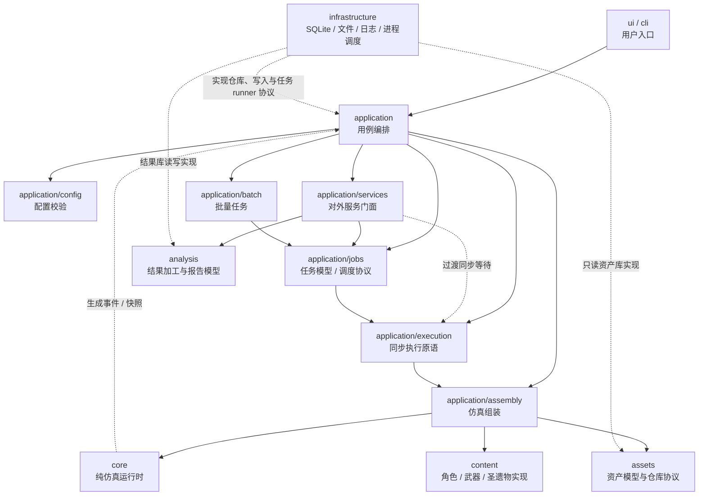
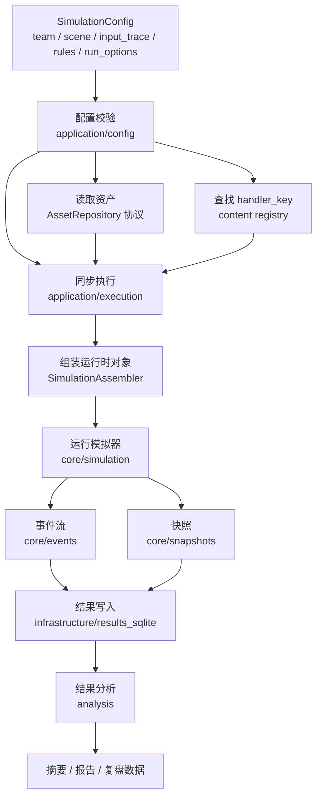
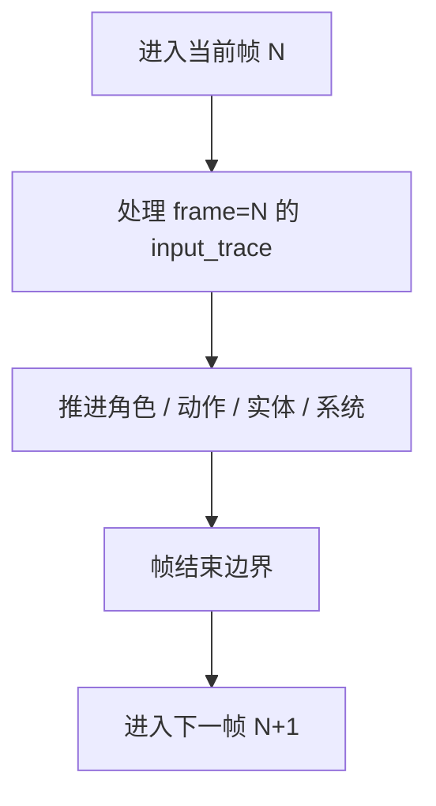
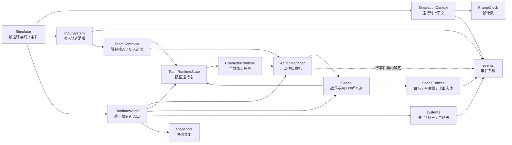

# 当前项目架构流程图

> 状态：草案。
> 本文档用流程图汇总当前项目的模块边界、单次仿真链路和输入轨迹进入模拟器后的目标流向。细节规则仍以对应架构与契约文档为准。

最后更新：2026-07-06

## 1. 文档范围

本文档用于辅助讨论整体架构，不替代以下文档：

- [模块边界设计](./模块边界设计.md)
- [事件系统设计](./事件系统/系统设计.md)
- [仿真配置契约与最小闭环](../契约/仿真配置契约与最小闭环.md)
- [输入轨迹契约草案](../契约/输入轨迹契约草案.md)

当前重点：

- 明确顶层模块依赖方向。
- 展示 `SimulationConfig` 到核心模拟器的流向。
- 展示 `input_trace` 在核心运行时中的目标处理位置。

## 2. 顶层模块依赖

边界约束：

- `core/` 不依赖 `assets/`、`content/`、`application/`、`infrastructure/`、`ui/`。
- `application/` 负责组装和编排，不直接写 SQLite 查询。
- `content/` 保存具体游戏内容实现，可以依赖 `core/` 和资产数据对象。
- `infrastructure/` 只实现具体技术适配。
- `ui/` 和 `cli/` 只通过 `application/` 调用能力。

## 3. 单次仿真主流程

说明：

- 缺资产、缺 handler、JSON 格式错误应在组装阶段暴露，不延迟到仿真运行中。
- 结果持久化属于 `infrastructure/`，核心只生成事件和快照。
- 分析加工属于 `analysis/`，不反向驱动核心运行。

## 4. 帧内处理顺序

目标语义：

- 第 N 帧输入在第 N 帧开始送达控制器。
- 后续动作状态机和系统推进可以看到本帧输入造成的状态变化。
- 帧开始和帧结束会发布 `FRAME_STARTED` / `FRAME_ENDED`；两者默认不进入事件记录。

## 5. 核心运行时内部关系

说明：

- `Simulator` 负责帧循环、调用输入消费入口、触发统一帧更新和判断终止条件。
- `SimulationContext` 保存运行时协作对象，例如时钟、事件引擎、输入系统和运行世界。
- `InputSystem` 消费输入轨迹并发布 `INPUT_KEY_CONSUMED`，记录按键事实，不判断动作是否成功。
- `TeamController` 解释队伍层输入。当前最小实现处理数字键切换槽位，并把动作按钮 `press` 转成动作请求。
- `TeamRuntimeState` 当前只保存队伍槽位数量和当前场上槽位；切人后摇、输入锁定等运行态仍待后续动作层补充。
- `ActionManager` 当前表达动作请求是否因 busy 窗口被接受或拒绝；动作事件等待动作模块评审后再确定。
- 被接受的动作请求会形成最小 `ActionInstance`；如果请求带目标查询且 `SimulationContext.space` 已挂载 `Space`，动作实例会记录 X/Z 平面候选目标 id。
- `ActionManager` 也是最小帧更新对象；存在未结束的动作或后摇 busy 窗口时，`RuntimeWorld` 不空闲，模拟器继续推进。
- `Space` 当前负责场景目标登记和 X/Z 平面范围查询，可挂载到 `SimulationContext.space`；Y 轴保留但不参与普通范围判定。
- `Space` 返回的是动作影响候选，不代表最终命中、伤害结算或反应触发。
- 第一版 `Space` 不处理移动输入、镜头、刚体碰撞或目标挤压。
- 具体角色、武器和圣遗物行为不放进 `core/`，而由 `content/` 通过组装阶段注入运行时对象。

## 6. 当前待讨论点

- `frame=0` 输入的精确定义。
- 切人动作后摇和输入锁定的具体帧数来源。
- 已接受动作实例如何展开为具体时间轴、命中点、伤害点和取消窗口。
- 快照和结果库如何持久化动作决策、状态变化与后续机制事件。
