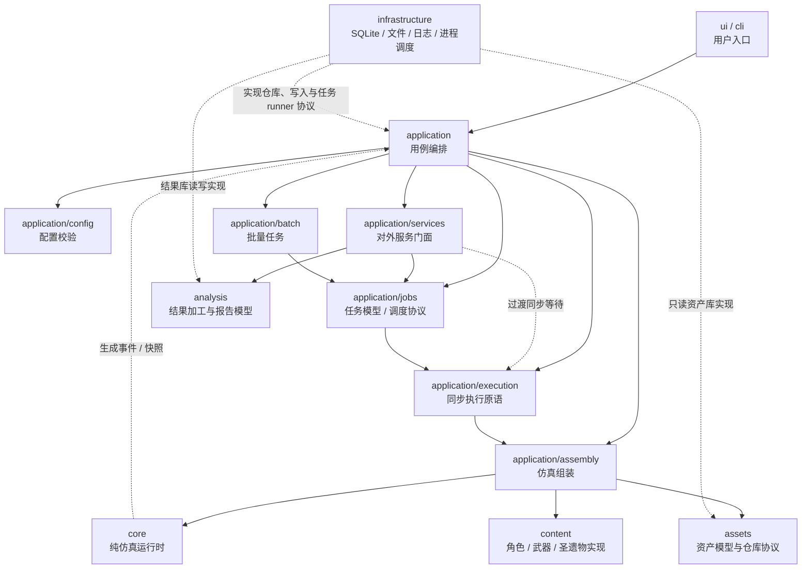
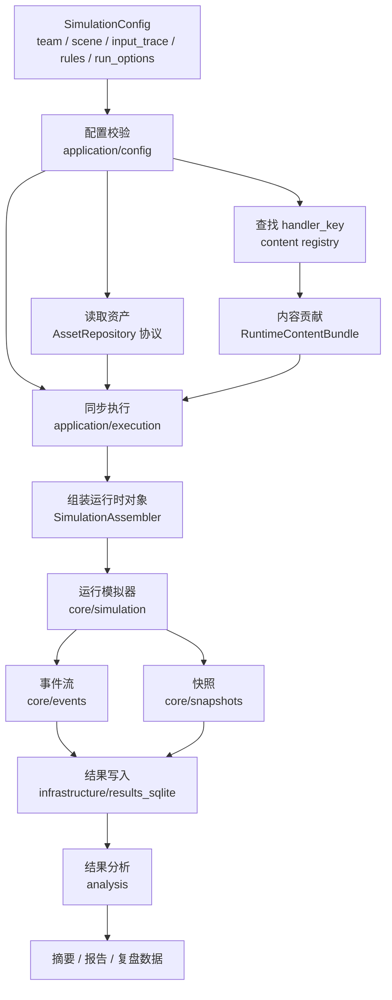
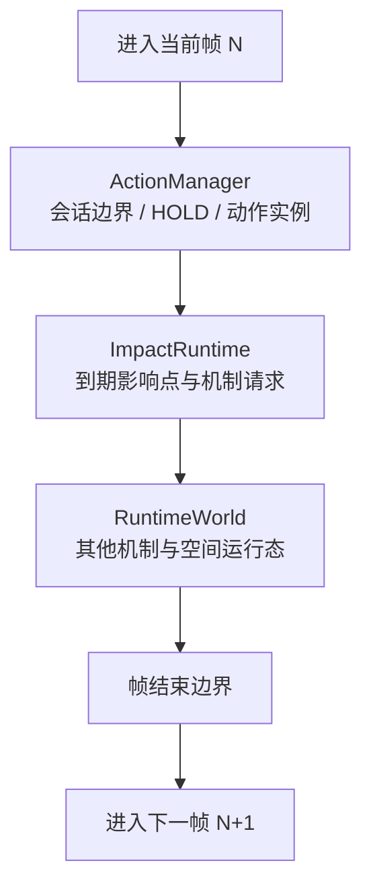

# 当前项目架构流程图

> 状态：草案。
> 本文档用流程图汇总当前项目的模块边界、单次仿真链路和按键输入进入模拟器后的目标流向。细节规则仍以对应架构与契约文档为准。

最后更新：2026-07-11

## 1. 文档范围

本文档用于辅助讨论整体架构，不替代以下文档：

- [模块边界设计](./模块边界设计.md)
- [事件系统设计](./事件系统/系统设计.md)
- [战场空间设计](./战场空间设计.md)
- [仿真配置契约与最小闭环](../契约/仿真配置契约与最小闭环.md)
- [按键输入契约](../契约/按键输入契约.md)
- [按键输入系统设计](./按键输入系统设计.md)

当前重点：

- 明确顶层模块依赖方向。
- 展示 `SimulationConfig` 到核心模拟器的流向。
- 展示输入会话计划进入 `ActionManager` 后的帧内链路。
- 展示 `RuntimeWorld` 内 action、impact、space 的运行时职责边界。

## 2. 顶层模块依赖

边界约束：

- `core/` 不依赖 `assets/`、`content/`、`application/`、`infrastructure/`、`ui/`。
- `application/` 负责组装和编排，不直接写 SQLite 查询。
- `content/` 保存具体游戏内容实现，可以依赖 `core/` 和资产数据对象。
- `infrastructure/` 只实现具体技术适配。
- `ui/` 和 `cli/` 只通过 `application/` 调用能力。

## 3. 单次仿真主流程

说明：

- 缺资产、缺 handler、JSON 格式错误应在组装阶段暴露，不延迟到仿真运行中。
- content registry 返回 `ContentRuntimeContribution`，由 `SimulationAssembler` 收集为 `RuntimeContentBundle` 后拆分注入运行时。
- 结果持久化属于 `infrastructure/`，核心只生成事件和快照。
- 分析加工属于 `analysis/`，不反向驱动核心运行。

## 4. 帧内处理顺序

目标语义：

- 按键输入轨迹在组装阶段由 `InputTraceCompiler` 编译为输入会话计划，不再保留独立的每帧 `InputSystem`。
- `ActionManager` 在第 N 帧处理预约动作、输入会话 PRESS/RELEASE、派生 HOLD、解释结果和动作实例推进。
- 每次解释结果立即应用，使同帧后续输入能够看到已经创建、取消或开始的动作状态。
- `ImpactRuntime` 在动作处理后展开本帧到期影响点，再由其他机制和空间运行态完成结算与收尾。
- 帧开始和帧结束会发布 `FRAME_STARTED` / `FRAME_ENDED`；两者默认不进入事件记录。

## 5. 核心运行时内部关系

```mermaid
flowchart LR
    CTX["SimulationContext<br/>运行时上下文"]
    CLOCK["FrameClock<br/>帧计数"]
    SIM["Simulator<br/>帧循环与终止条件"]
    INPUT_TRACE["InputSessionTrace<br/>组装期输入会话计划"]
    WORLD["RuntimeWorld<br/>本体逻辑运行"]
    TEAM_STATE["TeamRuntimeState<br/>active_slot / characters"]
    CHAR_STATE["CharacterRuntimeState<br/>槽位角色运行态"]
    TARGET_STATE["TargetRuntimeCollection<br/>目标运行态集合"]
    TARGET_ONE["TargetRuntimeState<br/>简单目标运行态"]
    CONTENT_BUNDLE["RuntimeContentBundle<br/>装配期拆分来源"]
    INTERPRETERS["ActionInterpreterRegistry<br/>输入会话解释器归属"]
    ACTION_REGISTRY["ActionRegistry<br/>action_key / Action"]
    ACTIONS["ActionManager<br/>输入会话与动作运行态拥有者"]
    ACTION_STATE["ActionInstance / ActionLock<br/>动作实例 / 具名锁"]
    IMPACT_RUNTIME["ImpactRuntime<br/>到期影响点处理"]
    SPACE_RUNTIME["SpaceRuntime<br/>空间运行态入口"]
    EFFECT_POINT["ActionImpactPoint<br/>最小影响点"]
    IMPACTS["ImpactDispatcher<br/>impact_key / ImpactFactory"]
    REQUESTS["ImpactRequestDispatcher<br/>机制请求分发"]
    CREATED_RUNTIME["CreatedObjectRuntime<br/>内容创建对象运行态"]
    CONTENT_STATE["ContentStateStore<br/>内容专属状态（非 core）"]
    TARGET_REF["CandidateTargetRef<br/>候选目标引用"]
    SPACE["Space<br/>空间实体拥有者"]
    PLAYER_ENTITY["SpatialEntity<br/>player:active"]
    TARGET_ENTITIES["SpatialEntity<br/>target:*"]
    CREATED_ENTITIES["SpatialEntity<br/>content-created:*"]
    EVENTS["events<br/>事件系统"]
    SNAPSHOTS["snapshots<br/>快照导出"]

    SIM --> CTX
    CTX --> CLOCK
    CTX --> EVENTS
    CTX --> SPACE_RUNTIME
    SIM --> WORLD

    WORLD --> ACTIONS
    WORLD --> IMPACT_RUNTIME
    WORLD --> SPACE_RUNTIME
    WORLD --> SNAPSHOTS
    INPUT_TRACE --> ACTIONS
    INTERPRETERS --> ACTIONS
    ACTION_REGISTRY --> ACTIONS

    SPACE_RUNTIME --> TEAM_STATE
    TEAM_STATE --> CHAR_STATE

    SPACE_RUNTIME --> TARGET_STATE
    TARGET_STATE --> TARGET_ONE

    ACTIONS --> ACTION_STATE
    SPACE_RUNTIME --> SPACE
    SPACE_RUNTIME --> CREATED_RUNTIME
    ACTION_STATE --> EFFECT_POINT
    EFFECT_POINT -. "到期后读取" .-> IMPACT_RUNTIME
    IMPACT_RUNTIME -. "due_impact_points / mark dispatched" .-> ACTIONS
    IMPACT_RUNTIME -. "到期目标解析" .-> SPACE_RUNTIME
    IMPACT_RUNTIME -. "impact_key" .-> IMPACTS
    IMPACT_RUNTIME -. "推进对象 tick / drain requests" .-> CREATED_RUNTIME
    IMPACTS -. "ImpactRequest tuple" .-> REQUESTS
    REQUESTS -. "create_entity" .-> CREATED_RUNTIME
    CREATED_RUNTIME -. "tick 产生机制请求" .-> REQUESTS
    CREATED_RUNTIME -. "同步 SpatialEntity" .-> SPACE_RUNTIME
    IMPACT_RUNTIME --> TARGET_REF
    ACTIONS -. "待事件契约确定" .-> EVENTS
    CONTENT_BUNDLE -. "贡献解释器" .-> INTERPRETERS
    CONTENT_BUNDLE -. "贡献 Action" .-> ACTION_REGISTRY
    CONTENT_BUNDLE -. "贡献 ImpactFactory" .-> IMPACTS
    CONTENT_BUNDLE -. "贡献对象行为" .-> CREATED_RUNTIME
    CONTENT_BUNDLE -. "持有内容状态" .-> CONTENT_STATE

    SPACE --> PLAYER_ENTITY
    SPACE --> TARGET_ENTITIES
    SPACE --> CREATED_ENTITIES
    TEAM_STATE -. "active_slot 同步到" .-> PLAYER_ENTITY
    TARGET_ONE -. "spatial_entity_id 关联" .-> TARGET_ENTITIES
    CREATED_RUNTIME -. "entity_id 关联" .-> CREATED_ENTITIES
    TARGET_REF -. "target_id / spatial_entity_id" .-> TARGET_ONE
```

说明：

- `Simulator` 负责帧循环、推进 `RuntimeWorld` 和判断终止条件；按键输入轨迹在组装阶段预先编译。
- `SimulationContext` 保存运行时协作对象，例如时钟、事件引擎和 `space_runtime`。
- `InputSessionTrace` 保存由 `InputTraceCompiler` 生成的会话计划和边界索引，完整计划中的未来 release 不向解释器提前暴露。
- `RuntimeWorld` 是本体逻辑运行入口，目标结构以 `ActionManager`、`ImpactRuntime`、机制系统和 `SpaceRuntime` 为主要运行时模块。
- `RuntimeContentBundle` 是装配期收集内容贡献后的拆分来源；`core/` 不接触完整内容贡献对象，只接收拆出的解释器、Action、ImpactFactory、对象行为和通用状态接口。
- `SpaceRuntime` 是空间运行态入口，持有 `Space`、`TeamRuntimeState` 引用、`TargetRuntimeCollection` 和 `CreatedObjectRuntime`，并提供受控的位置同步、空间查询和对象登记接口。
- `TeamRuntimeState` 持有一组按 1-based 槽位排列的 `CharacterRuntimeState`，队伍规模从角色集合派生；对外提供 `team_size`、`slots`、`current_character`、`get_character(slot)` 和 `switch_to(slot, frame)`。
- `CharacterRuntimeState` 保存槽位角色的稳定战斗身份与最小可变状态，例如 `character_key`、等级、命座、天赋等级、当前能量和 `combat_entity_id`；它不保存空间位置。
- `TargetRuntimeCollection` 是 `SpaceRuntime` 持有的多个简单目标运行态索引容器；`TargetRuntimeState` 保存目标 id、等级、抗性和 `spatial_entity_id`，不保存空间位置。
- `Space` 是 `SpaceRuntime` 持有的空间实体容器，负责 `player:active`、多个 `target:*` 和后续内容创建空间实体的空间实体；外部应通过 `SpaceRuntime` 的受控接口更新玩家空间实体、登记内容创建实体或查询候选实体。
- `ActionInterpreterRegistry` 根据输入键解析队伍或当前场上角色 selector，并在 PRESS 时固定会话的解释器 binding。
- `ActionRegistry` 保存组装阶段注册的不可变 Action 定义；解释器只返回 `action_key` 和准备参数。
- `ActionManager` 统一拥有输入会话、解释调用、动作准入、具名锁、动作实例和生命周期；它不硬编码切人键或具体角色动作逻辑。
- 所有被接受的动作都创建 `ActionInstance`，包括 `TeamSwitchAction`；切人由动作实例执行队伍状态修改并同步 `player:active`，不再由 SpaceRuntime 消费器承担核心逻辑。
- Action 在运行过程中产生 `ActionImpactPoint`；目标默认在影响点到期帧按当前空间状态解析，不在实例创建时提前固化。
- `ImpactRuntime` 从 `ActionManager` 读取到期 `ActionImpactPoint`，通过 `SpaceRuntime` 解析候选目标，调用 `ImpactDispatcher` 展开机制请求，并在处理后标记影响点已分发。
- `ImpactDispatcher` 只按 `impact_key` 找到内容贡献的 `ImpactFactory`，把动作影响上下文展开为具体机制请求；它不负责帧更新、目标解析或对象 tick。
- `ImpactRequestDispatcher` 按请求 kind 分发到伤害、治疗、附着、状态、空间对象、能量或移动系统。
- 内容创建的场上对象不再通过独立 `core/summons` 表达；它们应作为带生命周期的空间实体，由 `SpaceRuntime` 持有的 `CreatedObjectRuntime` 与 `Space` 协作管理，并由 `ImpactRuntime` 在帧内推进对象 tick 与转发对象产生的机制请求。无空间位置的持续逻辑归机制、状态或 hook，不命名为召唤物。
- `ContentStateStore` 位于 `content`，由装配期创建并放在 `RuntimeContentBundle`；核心运行时只接收拆出的通用协议实现。
- `ActionManager` 是首要帧更新对象；只要仍有未来输入边界、held/listening 会话或 scheduled/running 动作实例，运行世界就不能空闲。
- `SpaceRuntime` 当前负责把空间运行态挂载到 `SimulationContext.space_runtime`；其内部 `Space` 负责当前场上角色空间实体、多个简单目标点位登记和 X/Z 平面范围查询，Y 轴保留但不参与普通范围判定。
- `Space` 返回的是动作影响候选空间实体，不代表最终命中、伤害结算或反应触发。
- 第一版 `Space` 不处理移动输入、镜头、复杂目标体型、多 hitbox、刚体碰撞或目标挤压。
- 具体角色、武器和圣遗物行为不放进 `core/`，而由 `content/` 通过组装阶段注入运行时对象。

## 6. 当前待讨论点

- 切人动作后摇、具名锁和中断窗口的具体帧数来源。
- 具体角色 Action、控制命令和 action_state 的 schema。
- 快照和结果库如何持久化动作决策、状态变化与后续机制事件。
