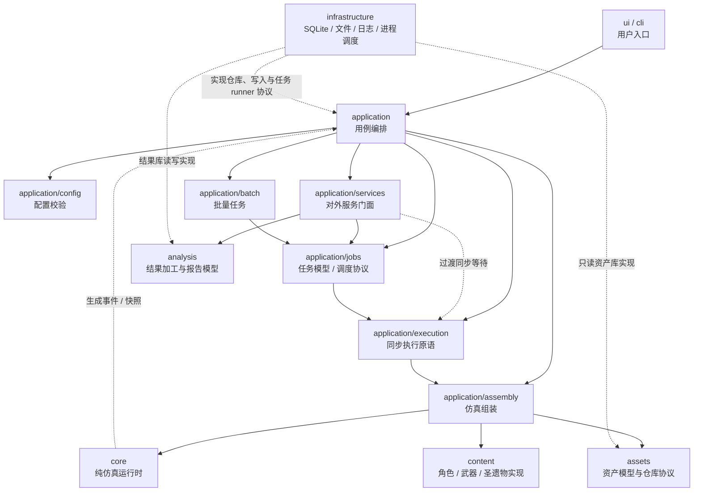
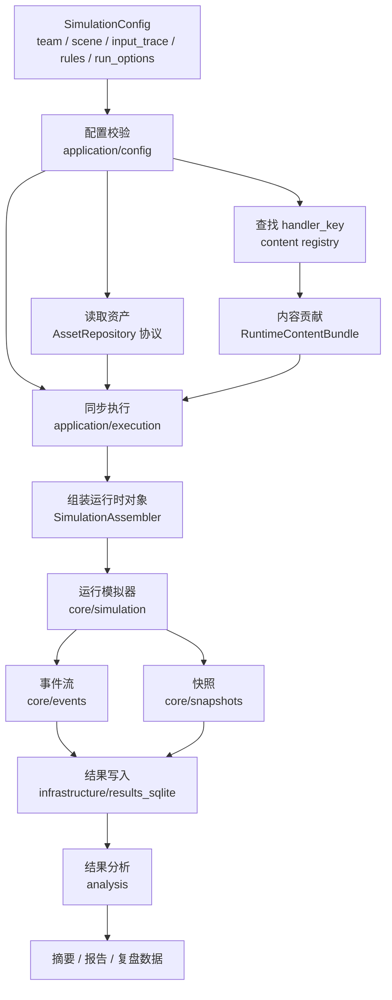
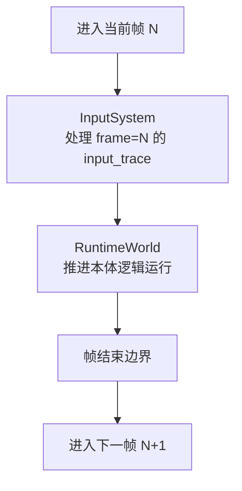

# 当前项目架构流程图

> 状态：草案。
> 本文档用流程图汇总当前项目的模块边界、单次仿真链路和输入轨迹进入模拟器后的目标流向。细节规则仍以对应架构与契约文档为准。

最后更新：2026-07-08

## 1. 文档范围

本文档用于辅助讨论整体架构，不替代以下文档：

- [模块边界设计](./模块边界设计.md)
- [事件系统设计](./事件系统/系统设计.md)
- [战场空间设计](./战场空间设计.md)
- [仿真配置契约与最小闭环](../契约/仿真配置契约与最小闭环.md)
- [输入轨迹契约草案](../契约/输入轨迹契约草案.md)

当前重点：

- 明确顶层模块依赖方向。
- 展示 `SimulationConfig` 到核心模拟器的流向。
- 展示 `InputSystem` 与 `RuntimeWorld` 的同级关系。
- 展示 `RuntimeWorld` 内 team、action、space 的运行时职责边界。

## 2. 顶层模块依赖

边界约束：

- `core/` 不依赖 `assets/`、`content/`、`application/`、`infrastructure/`、`ui/`。
- `application/` 负责组装和编排，不直接写 SQLite 查询。
- `content/` 保存具体游戏内容实现，可以依赖 `core/` 和资产数据对象。
- `infrastructure/` 只实现具体技术适配。
- `ui/` 和 `cli/` 只通过 `application/` 调用能力。

## 3. 单次仿真主流程

说明：

- 缺资产、缺 handler、JSON 格式错误应在组装阶段暴露，不延迟到仿真运行中。
- content registry 返回 `ContentRuntimeContribution`，由 `SimulationAssembler` 收集为 `RuntimeContentBundle` 后拆分注入运行时。
- 结果持久化属于 `infrastructure/`，核心只生成事件和快照。
- 分析加工属于 `analysis/`，不反向驱动核心运行。

## 4. 帧内处理顺序

目标语义：

- 第 N 帧输入在第 N 帧开始由 `InputSystem` 消费。
- `InputSystem` 负责按键事实、按键状态和输入分发，不直接拥有队伍、角色或空间状态。
- `RuntimeWorld` 与 `InputSystem` 是同级运行时入口，负责在输入消费后推进本体逻辑。
- 后续动作状态机和运行时模块推进可以看到本帧输入造成的状态变化。
- 帧开始和帧结束会发布 `FRAME_STARTED` / `FRAME_ENDED`；两者默认不进入事件记录。

## 5. 核心运行时内部关系

```mermaid
flowchart LR
    CTX["SimulationContext<br/>运行时上下文"]
    CLOCK["FrameClock<br/>帧计数"]
    SIM["Simulator<br/>帧循环与终止条件"]
    INPUT_SYS["InputSystem<br/>输入轨迹消费"]
    WORLD["RuntimeWorld<br/>本体逻辑运行"]
    TEAM_STATE["TeamRuntimeState<br/>active_slot / characters"]
    CHAR_STATE["CharacterRuntimeState<br/>槽位角色运行态"]
    TARGET_STATE["TargetRuntimeCollection<br/>目标运行态集合"]
    TARGET_ONE["TargetRuntimeState<br/>简单目标运行态"]
    TEAM_ACTIONS["TeamActionController<br/>队伍输入路由 / 输入会话"]
    ACTIONS["ActionManager<br/>动作调度与动作运行态拥有者"]
    ACTION_STATE["ActionInstance / ActionLock<br/>动作实例 / busy 窗口"]
    SPACE_RUNTIME["SpaceRuntime<br/>空间运行态入口"]
    EFFECT_POINT["ActionImpactPoint<br/>最小影响点"]
    IMPACTS["ImpactDispatcher<br/>impact_key 分发"]
    CREATED_RUNTIME["CreatedObjectRuntime<br/>内容创建对象运行态"]
    CONTENT_STATE["ContentStateStore<br/>内容专属运行态"]
    TARGET_REF["CandidateTargetRef<br/>候选目标引用"]
    SPACE["Space<br/>空间实体拥有者"]
    PLAYER_ENTITY["SpatialEntity<br/>player:active"]
    TARGET_ENTITIES["SpatialEntity<br/>target:*"]
    CREATED_ENTITIES["SpatialEntity<br/>content-created:*"]
    EVENTS["events<br/>事件系统"]
    SNAPSHOTS["snapshots<br/>快照导出"]

    SIM --> CTX
    CTX --> CLOCK
    CTX --> EVENTS
    SIM --> INPUT_SYS
    SIM --> WORLD

    INPUT_SYS --> EVENTS
    INPUT_SYS --> TEAM_ACTIONS

    WORLD --> TEAM_ACTIONS
    WORLD --> ACTIONS
    WORLD --> SPACE_RUNTIME
    WORLD --> SNAPSHOTS

    SPACE_RUNTIME --> TEAM_STATE
    TEAM_STATE --> CHAR_STATE

    SPACE_RUNTIME --> TARGET_STATE
    TARGET_STATE --> TARGET_ONE

    TEAM_ACTIONS --> ACTIONS
    ACTIONS --> ACTION_STATE
    ACTIONS --> SPACE_RUNTIME
    SPACE_RUNTIME --> SPACE
    SPACE_RUNTIME --> CREATED_RUNTIME
    ACTION_STATE --> EFFECT_POINT
    EFFECT_POINT -. "impact_key" .-> IMPACTS
    IMPACTS -. "创建空间实体请求" .-> CREATED_RUNTIME
    CREATED_RUNTIME -. "同步 SpatialEntity" .-> SPACE_RUNTIME
    ACTION_STATE --> TARGET_REF
    ACTIONS -. "待事件契约确定" .-> EVENTS
    CONTENT_STATE -. "由 content bundle 创建" .-> TEAM_ACTIONS

    SPACE --> PLAYER_ENTITY
    SPACE --> TARGET_ENTITIES
    SPACE --> CREATED_ENTITIES
    PLAYER_ENTITY -. "active_slot 同步自队伍运行态" .-> TEAM_STATE
    TARGET_ONE -. "spatial_entity_id 关联" .-> TARGET_ENTITIES
    CREATED_RUNTIME -. "entity_id 关联" .-> CREATED_ENTITIES
    TARGET_REF -. "target_id / spatial_entity_id" .-> TARGET_ONE
    EFFECT_POINT -. "携带候选引用" .-> TARGET_REF
```

说明：

- `Simulator` 负责帧循环、调用 `InputSystem`、推进 `RuntimeWorld` 和判断终止条件。
- `SimulationContext` 保存运行时协作对象，例如时钟、事件引擎和 `space_runtime`。
- `InputSystem` 消费输入轨迹并发布 `INPUT_KEY_CONSUMED`，记录按键事实和按键状态，不直接修改队伍、角色或空间状态。
- `RuntimeWorld` 是本体逻辑运行入口，当前目标结构收束为 `TeamActionController`、`ActionManager`、`SpaceRuntime`、`ImpactRuntime` 等运行时模块。
- `SpaceRuntime` 是空间运行态入口，持有 `Space`、`TeamRuntimeState` 引用、`TargetRuntimeCollection` 和 `CreatedObjectRuntime`，并负责空间实体动作消费协调。
- `TeamRuntimeState` 持有一组按 1-based 槽位排列的 `CharacterRuntimeState`，队伍规模从角色集合派生；对外提供 `team_size`、`slots`、`current_character`、`get_character(slot)` 和 `switch_to(slot, frame)`。
- `CharacterRuntimeState` 保存槽位角色的稳定战斗身份与最小可变状态，例如 `character_key`、等级、命座、天赋等级、当前能量和 `combat_entity_id`；它不保存空间位置。
- `TargetRuntimeCollection` 是 `SpaceRuntime` 持有的多个简单目标运行态索引容器；`TargetRuntimeState` 保存目标 id、等级、抗性和 `spatial_entity_id`，不保存空间位置。
- `Space` 是 `SpaceRuntime` 持有的空间实体容器，负责 `player:active`、多个 `target:*` 和后续内容创建空间实体的空间实体；外部应通过 `SpaceRuntime` 的受控接口更新玩家空间实体、登记内容创建实体或查询候选实体。
- `TeamActionController` 是队伍级输入路由器，负责输入会话、切人输入翻译、当前槽位动作解释器选择，以及把解释完成的 `ActionTimelineSpec` 提交给 `ActionManager`。
- `InputSystem` 将输入事实送达 `TeamActionController`；动作按钮 `press` 只创建输入会话，不立即创建动作实例。
- `TeamActionController` 只读取当前 `active_slot`，不持有或修改 `TeamRuntimeState`；切人输入被翻译成 `team.switch` 动作时间轴。
- `ActionManager` 是动作调度与动作运行态拥有者，负责 busy 窗口、动作实例、动作时间轴、候选空间实体记录和通用消费记录；它不解释原始输入，不处理 press/release 生命周期，也不判断目标槽位是否合法。
- `SpaceRuntime` 按 `(actor_entity_id, action_key)` 把已接受动作实例分发给空间实体绑定的运行态消费器；当前 `player:active / team.switch` 由切人消费器调用 `TeamRuntimeState.switch_to(...)` 并同步 `Space.update_active_character_slot(...)`。
- 被接受的动作时间轴会形成最小 `ActionInstance`；如果时间轴带空间查询且 `SimulationContext.space_runtime` 已挂载，动作实例会记录 X/Z 平面候选空间实体 id。
- `ActionInstance.candidate_targets` 保存 `SpaceRuntime` 从候选空间实体解析到 `TargetRuntimeState` 的 `CandidateTargetRef`，仅表示候选目标引用，不代表最终命中、伤害结算或反应触发。
- 第一版 `ActionInstance.impact_points` 可以生成默认 `ActionImpactPoint`；未声明偏移时发生在动作开始帧，并携带同一组候选空间实体和候选目标引用。角色内容可以按 `impact_key` 声明相对动作开始帧的偏移，或在没有可信影响点时关闭默认生成。它只是动作时间轴上的候选影响点，不是最终命中、伤害结算或反应触发。
- `ImpactDispatcher` 按 `impact_key` 找到内容贡献的 `ImpactFactory`，用于后续把动作影响点展开为机制请求或空间实体创建请求。
- 内容创建的场上对象不再通过独立 `core/summons` 表达；它们应作为带生命周期的空间实体，由 `SpaceRuntime` 持有的 `CreatedObjectRuntime` 与 `Space` 协作管理。无空间位置的持续逻辑归机制、状态或 hook，不命名为召唤物。
- `ContentStateStore` 位于 `content`，由装配期创建并放在 `RuntimeContentBundle`；核心运行时只接收拆出的通用协议实现。
- `ActionManager` 也是最小帧更新对象；存在未结束的动作或后摇 busy 窗口时，`RuntimeWorld` 不空闲，模拟器继续推进。
- `SpaceRuntime` 当前负责把空间运行态挂载到 `SimulationContext.space_runtime`；其内部 `Space` 负责当前场上角色空间实体、多个简单目标点位登记和 X/Z 平面范围查询，Y 轴保留但不参与普通范围判定。
- `Space` 返回的是动作影响候选空间实体，不代表最终命中、伤害结算或反应触发。
- 第一版 `Space` 不处理移动输入、镜头、复杂目标体型、多 hitbox、刚体碰撞或目标挤压。
- 具体角色、武器和圣遗物行为不放进 `core/`，而由 `content/` 通过组装阶段注入运行时对象。

## 6. 当前待讨论点

- `frame=0` 输入的精确定义。
- 切人动作后摇和输入锁定的具体帧数来源。
- 已接受动作实例如何从默认影响点扩展为具体角色时间轴、命中点、伤害点和取消窗口。
- 快照和结果库如何持久化动作决策、状态变化与后续机制事件。
