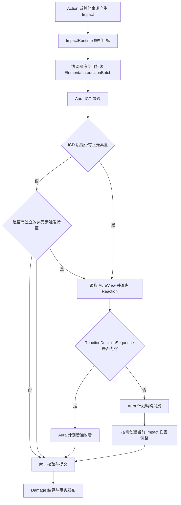

# 元素反应判定与执行流程

> 状态：生效；已按当前 `ReactionBatchPlanner.prepare()/seal()` 与元素交互协调器生产流程整理。

最后更新：2026-08-02

## 1. 流程入口

元素反应不是 Action、Impact 或 Event 的回调。一次攻击或无伤害元素施加先形成类型化 Impact，再由元素反应协调器为每个目标建立稳定的目标级 work 和 `interaction_id`。



带 ICD Binding 的物理命中可以推进 ICD，但因为没有正元素施加，不创建 Aura 请求，也不能触发蒸发或融化。若命中还携带 `strike_type` 等独立强类型触发特征，协调器仍可为其他反应创建 Reaction 请求。物理元素不进入 `Element` 枚举。

## 2. 后手预算

元素施加意图通过 ICD 后，协调器计算：

```text
incoming_amount = elemental_amount * icd_coefficient
```

该值同时是：

- Reaction 当前决策序列的后手元素预算；
- 无反应时 Aura 普通附着的实际原始元素量。

普通附着的 `20%` 损耗不在 Reaction 之前预先扣除。反应先使用完整的 ICD 后预算；只有没有被反应消费、并且规则允许形成持久附着的部分，才由 Aura 使用自己的附着规则处理。

## 3. 单个 interaction 的准备

协调器为同一 batch 创建 ICD、Aura、Reaction 和 ReactionState Planner。普通蒸发、融化的核心准备顺序为：

1. ICD Planner 根据 Binding 准备 `IcdImpactRequest`。
2. 计算 ICD 后 `incoming_amount`。
3. 从 Aura Planner 取得当前目标的虚拟 `AuraView`。
4. 构造 `ReactionEvaluationRequest`。
5. `ReactionBatchPlanner.prepare()` 调用 `ReactionRuntime.evaluate()`。
6. 如果决议包含元素变化，Aura Planner 准备精确消费。
7. 如果无匹配反应且后手量为正，Aura Planner 准备普通附着。
8. 如果当前 Damage Impact 具备增幅资格，协调器把 Reaction 调整转换为 Damage 的 `AmplifyingReactionInput`；如果交互满足激化资格，则转换为 `CatalyzeReactionInput`。

Planner 只维护本 batch 的虚拟投影，真实 Runtime 在全部计划 seal 和预校验完成前保持不变。

## 4. 候选与方向选择

Reaction 候选由显式签名匹配，不依赖 Registry 顺序：

```text
incoming_element
+ observed_aura_kind
+ 其他强类型触发条件
-> direction_key
-> ReactionDefinition / Profile / Rule
```

普通蒸发和融化没有候选歧义：每个有效的后手元素与先手 Aura 组合只对应一个方向。具体规则见：

- [蒸发反应设计](./反应/蒸发反应设计.md)
- [融化反应设计](./反应/融化反应设计.md)
- [超载反应设计](./反应/超载反应设计.md)
- [超导反应设计](./反应/超导反应设计.md)
- [冻结反应设计](./反应/冻结反应设计.md)
- [碎冰反应设计](./反应/碎冰反应设计.md)
- [感电反应设计](./反应/感电反应设计.md)
- [扩散反应设计](./反应/扩散反应设计.md)
- [结晶反应设计](./反应/结晶反应设计.md)
- [燃烧反应设计](./反应/燃烧反应设计.md)
- [激化反应设计](./反应/激化反应设计.md)
- [绽放反应设计](./反应/绽放反应设计.md)

后续多 Aura 或状态型反应可以产生多步骤序列，但不得通过一个机制目录直接调用另一个机制 Runtime。复合顺序必须由 Reaction 公共候选逻辑显式表达。

## 5. DecisionSequence

`ReactionDecisionSequence` 表示同一后手预算在一次交互中的完整反应决策：

- `step_ordinal` 从 `0` 连续编号；
- 后一步读取前一步形成的虚拟元素和 Reaction 状态；
- 后手剩余量可以继续参与后续步骤；
- 序列结束后的后手剩余量不自动写入 Aura；
- 是否形成持久后手 Aura 必须由明确 Effect 或无反应附着分支决定。

普通蒸发和融化只有一个决策步骤。激化则把附加反应、原激化覆盖和类草燃烧链接作为显式步骤或状态计划；稳定顺序与失败边界见[激化反应设计](./反应/激化反应设计.md)。该统一模型使各反应可以参与后续复合候选，而不需要在单个反应目录中了解其他反应。

状态型候选同样进入该序列。钝击命中冻结目标时，碎冰步骤先投影移除 `FROZEN` Aura 与 `FrozenState`；若同一 Impact 还携带正元素预算，后续步骤再读取暴露出的藏水或藏冰。该顺序不通过 Registry 顺序或 EventEngine 回调推导。

## 6. 当前 Impact 伤害调整

反应成立与当前伤害获得增幅是两个不同判断：

- 反应是否成立取决于后手元素、后手预算和目标 Aura；
- 只有 `current_damage_element is incoming_element` 时才创建 `CurrentImpactDamageAdjustment`；
- 无伤害元素施加可以形成 occurrence 和 Aura 消费，但没有当前 Damage，因此不创建调整；
- Damage 最终为零或随后被护盾完全吸收，不撤销已经成立的反应。

协调器把增幅调整转换为 Damage 自己拥有的 `AmplifyingReactionInput`，把激化调整转换为 `CatalyzeReactionInput`。Reaction 不读取元素精通，不计算最终伤害；激化公式、实时精通读取和审计由[激化反应设计](./反应/激化反应设计.md)与 Damage 系统共同拥有。

## 7. 即时剧变后续执行

普通超载、超导在 round 0 只形成 occurrence、元素变化和冻结的 Effect Group。round 0 提交并发布事实后，`ElementalSettlementWorkQueue` 才执行后续工作：

```text
round 0 occurrence
-> enqueue ReactionEffectGroup
round 1 freeze targets
-> target eligibility
-> optional strike state Reaction
-> Damage Gate
-> optional Buff
-> Damage
-> enqueue committed child Effects into round 2
```

目标集合按 Effect Group 只冻结一次。Damage 与 Status 可以共享查询但按 capability 使用不同子集。元素量为零的 Damage Effect 不附着元素；若 Effect 声明稳定 `strike_type`，仍可触发碎冰等状态型反应。

## 8. 冻结状态生命周期

普通冻结 occurrence 形成后，协调器在主交互 batch 内：

```text
计算新有效冻元素量
-> 投影活动冻结或解冻恢复速率
-> 计划 FROZEN Aura
-> 计划 FrozenState
-> 校验 Aura/State Link
```

`FrozenState.next_required_frame` 是自然到期的必需处理帧。帧推进不能跨过该帧；到期工作在同帧 Action/Impact 前原子移除 linked Aura/State，并在衰减速率高于最低值时保存不延长仿真的 `FreezeRecoveryState`。碎冰沿用同一移除与恢复语义。

## 9. 感电周期与传播

普通感电 occurrence 不消费水雷 Aura，后手剩余预算按普通持久附着形成第二种 Aura；首次建立同时创建 `ElectroChargedState` 和当前帧 Effect Group。状态的 `next_required_frame` 到期后，帧协调器先完成 Aura 衰减，再物化确定性的 `ElectroChargedTickRootWork` 并推进周期游标。

周期 root 通过 scheduled adapter 生成无 occurrence 的雷元素剧变 Effect。Effect Group 冻结主目标和 X/Z 平面 `13` 米内的正水 Aura 候选，为每个目标分别准备 `30/1` Gate；只有 Gate 通过且目标仍为感电双 Aura 时，才消费水雷各最多 `0.4 GU`，并可对其他感电目标接管来源和同步周期。普通水目标只受传导雷伤，不被施加雷或创建状态。

再附着更新来源捕获但不产生额外脉冲、不重置周期；周期伤害不创建新的 `REACTION_OCCURRED`。完整方向、公式、状态字段和传播失败边界见[感电反应设计](./反应/感电反应设计.md)。

## 10. 无反应分支

以下情况对普通蒸发、融化是正常的空决议：

- ICD 系数为 `0`，后手预算为零；
- 目标没有匹配的 Aura；
- 后手元素与观察 Aura 不构成已注册方向；
- 同元素施加；
- 输入属于该专门规则不处理的状态或元素组合。

空决议不发布 `REACTION_OCCURRED`。如果仍有合法元素施加，则继续由 Aura 处理普通附着或同元素更新。

## 11. 失败边界

以下情况属于领域错误而不是“无反应”：

- Definition、Profile、handler 或方向引用缺失；
- 同一 batch 中 `interaction_id` 或 `order` 重复；
- Planner 已 seal 后继续 prepare；
- 计划帧与 batch 帧不一致；
- 计划捕获的 Store version 已过期；
- Aura 与 FrozenState 的 Link 或前值不一致；
- Damage Profile、属性输入或最终增幅乘数非法。

这些错误必须在事实发布前暴露，并阻止整个元素交互批次提交。
