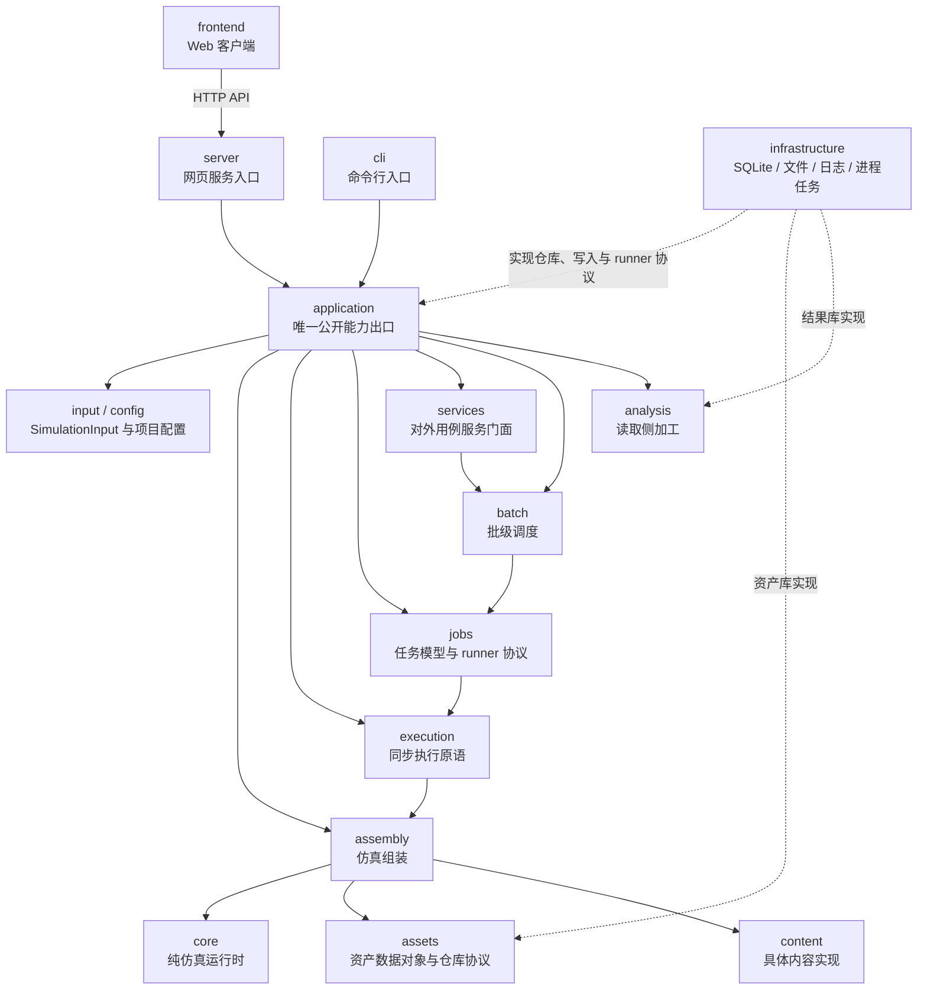
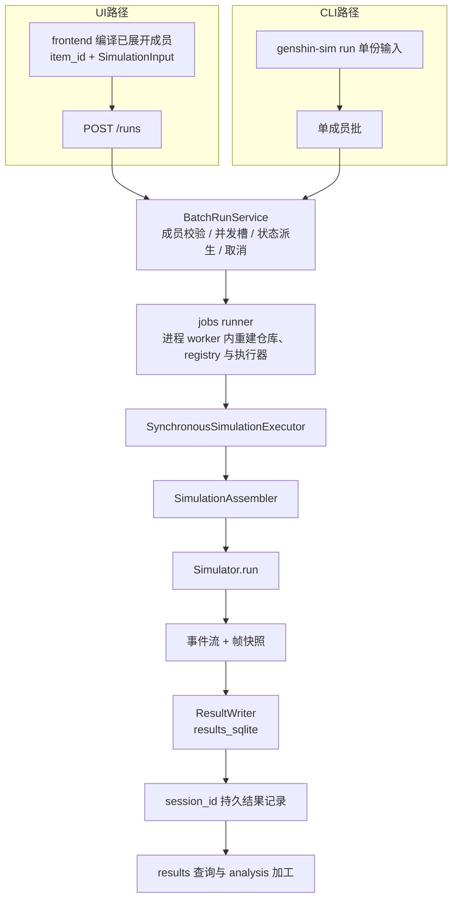
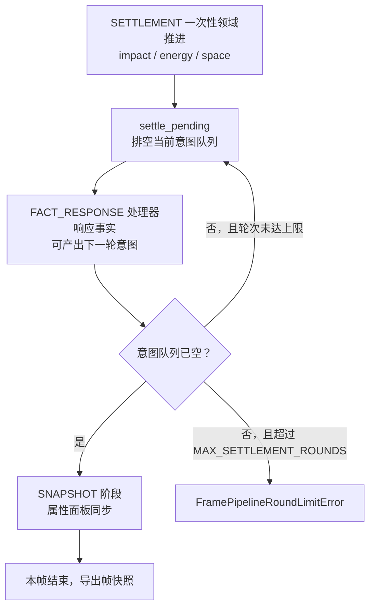
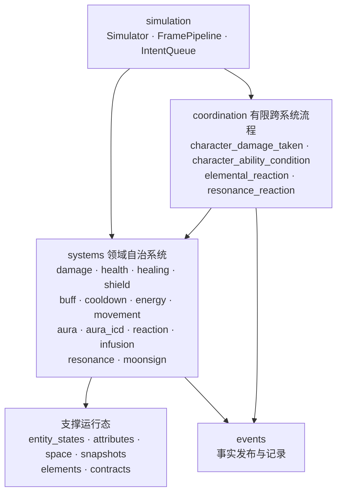

# 项目架构流程图

> 状态：生效，随重大结构变化更新。
> 最后更新：2026-08-23。
> 本文用流程图提供整体架构与运行链路的导航视角；模块职责见[模块边界设计](./模块边界设计.md)，领域规则以各系统架构/契约文档为准。本文不复述职责文本，只表达连接关系与执行顺序。

## 1. 顶层模块依赖

说明：

- 入口只有 `cli/` 与 `server/`，都只能经 `genshin_sim.application` 公开出口调用能力；导入边界由 `tests/unit/cli/` 与 `tests/unit/server/` 的导入边界测试守护。
- `frontend/` 只通过 HTTP API 访问 server，不 import Python 代码。
- `infrastructure/` 以协议实现身份从外侧注入，不属于任何入口或核心模块。
- `core/` 不依赖图中任何其他模块。

## 2. 端到端执行链路

两条入口路径汇入同一执行原语：

说明：

- 批是调度概念：`run_id` 是内存句柄，批进入终态后保留固定查询窗口即释放；唯一持久身份是结果库 `session_id`。生命周期、状态机与错误语义见[批处理调度设计](./批处理调度设计.md)。
- 变体编译在 `frontend/` 完成，后端只接收已展开成员；CLI 的单份输入按单成员批进入同一链路。
- worker 进程内部重建资产仓库、content registry 与同步执行器；不跨进程共享 SQLite 连接或已组装运行时对象。

## 3. 帧内阶段管线

每帧由 `Simulator` 驱动：发布 `FRAME_STARTED` → `FramePipeline.update_frame` 按固定阶段顺序推进 → 导出帧快照 → 发布 `FRAME_ENDED`。整场仿真首尾另有 `SIMULATION_STARTED` / `SIMULATION_ENDED`。

阶段顺序与当前挂载（`application/assembly/stages/runtime_assembler.py`）：

| 阶段 | 职责 | 当前挂载 |
| --- | --- | --- |
| `TIME_ADVANCE` | 计时类领域推进 | buff、infusion、shield、cooldown、movement、resonance、元素结算协调器 |
| `INPUT_INTERPRET` | 输入解释（预留） | 当前无挂载；输入会话解释由 ACTION_ADVANCE 的 ActionManager 承担 |
| `ACTION_ADVANCE` | 动作推进 | action_manager：预约动作、PRESS/RELEASE、HOLD 派生、动作实例推进、影响点产生 |
| `SETTLEMENT` | 统一意图结算 | impact、energy、space 先做一次性领域推进，随后进入多轮结算循环 |
| `FACT_RESPONSE` | 事实响应 | moonsign、resonance_reactions、content_hooks；随每轮结算驱动 |
| `SNAPSHOT` | 快照后处理 | attributes_panel 属性面板同步 |

结算多轮循环：

说明：

- 所有跨对象副作用以意图进入统一意图队列，在结算阶段按轮次排空；事实先落定，响应在后，避免结算递归。
- 同帧内后到的输入可以看到先前动作实例已创建、取消或开始的状态。
- 帧边界事件默认不进入结果库事件记录。

## 4. core 运行时领域地图

粗粒度关系，细节见各系统文档：

说明：

- 领域系统互不 import 对方 Runtime 或 Store；只读依赖走中立共享模型或窄协议，跨系统写入只经 coordination 中对应的协调器。
- `EventEngine` 只发布和记录已发生的事实，不是写入入口。
- 角色、武器、圣遗物行为不进入 `core/`，由 `content/` 在组装阶段以解释器、Action、ImpactFactory、provider 与 hook 注入。
- 所有权、计划提交与事实发布的完整规则见[领域运行态实现规范](../工程/领域运行态实现规范.md)与[系统自治与跨系统协调规范](../工程/系统自治与跨系统协调规范.md)。

## 5. 关联文档

- [模块边界设计](./模块边界设计.md)：顶层目录、模块职责与硬规则
- [批处理调度设计](./批处理调度设计.md)：批概念、生命周期、调度与错误语义
- [领域运行态实现规范](../工程/领域运行态实现规范.md)：状态所有权、计划提交与共享抽象门槛
- [系统自治与跨系统协调规范](../工程/系统自治与跨系统协调规范.md)：系统自治与协调外置结论
- [事件系统设计](./事件系统/系统设计.md)与[事件类型](./事件系统/事件类型.md)：事件契约
